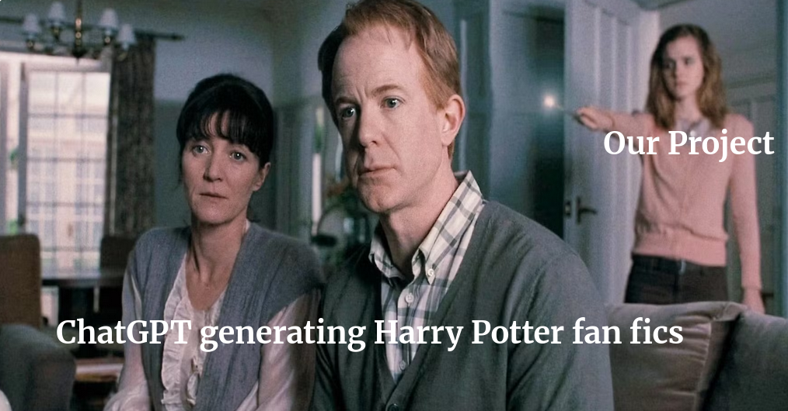
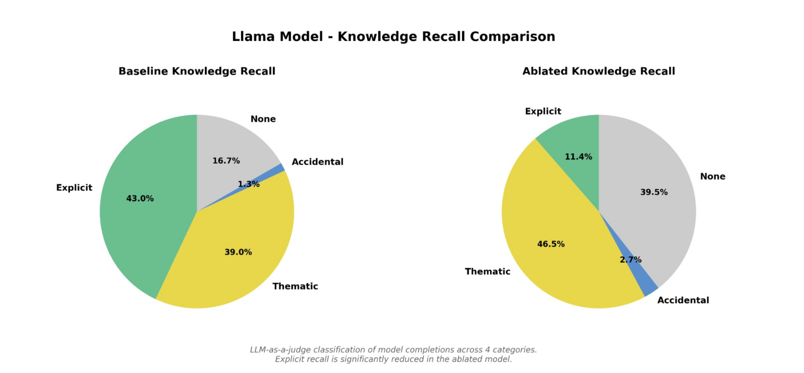
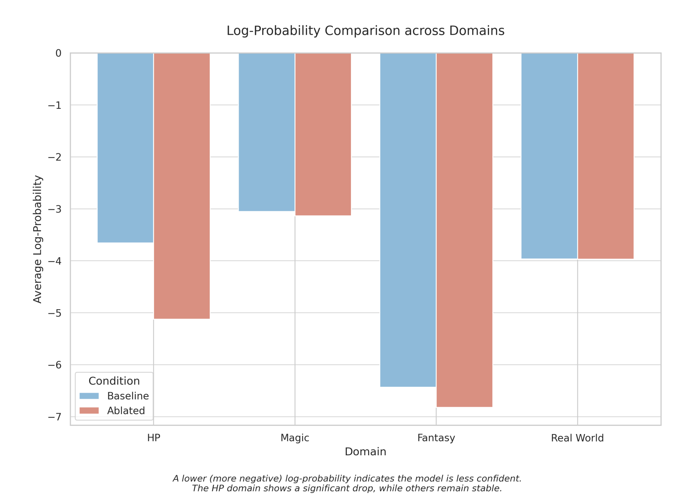

# Knowledge Unlearning in Language Models using Sparse Autoencoders

Course Project for *Introduction to Natural Language Processing (INLP)*, IIIT Hyderabad


## Team

- Jayant Gupta
- Gopal Kataria
- Manas Agrawal 
- Mohammad Akmal Ali 


---

## Project Overview



This project investigates selective knowledge removal in large language models through mechanistic interpretability techniques. The goal is to remove knowledge associated with the *Harry Potter* domain from a pretrained llama-2-7b-chat model while preserving the model’s general linguistic and reasoning capabilities.

Traditional approaches to model editing rely on gradient-based fine-tuning or parameter modification, which may introduce unintended side effects or degrade general performance. In contrast, this work employs **Sparse Autoencoders (SAEs)** trained on internal transformer activations to identify interpretable features corresponding to specific knowledge domains. By selectively ablating these features during inference, it becomes possible to remove targeted knowledge in a controlled and interpretable manner.

The approach focuses on identifying high-level features in the residual stream of the transformer that are strongly associated with Harry Potter concepts. These features are then suppressed at inference time using forward hooks, allowing the model to generate responses without relying on the removed knowledge.

## Performance on Llama 7-B

The suppression is highly localized to the Harry Potter domain across both model versions. In the v2 Llama model, the HP domain shift (−0.82) is approximately 8× greater than the Fantasy domain shift (−0.25) and 27× greater than the Magic shift (−0.10), with Real World facts virtually unchanged (−0.03).





---

## [Training Instructions](#training-instructions-detailed)

## Running the Project

Pretrained model is available at [hugging face repo](https://huggingface.co/kiyohan/llama-hp-unlearning-artifacts/tree/main). It's automatically download from demo.py.

### Run Demo

```bash
git clone https://github.com/bropal404/INLP_PROJECT.git
cd INLP_PROJECT

# Install requirements
pip  -r requirements.txt  

# run demo
# takes time to download LLama 7B (around 20 mins on LAN,
#  needs sufficient VRAM and RAM)
python3 demo.py 
```


### Controls

| Action | Shortcut |
|---|---|
| Send prompt | `Enter` or `Ctrl+S` |
| Toggle HP ablation on/off | `Ctrl+A` or click ** Ablation** button |
| Quit | `Ctrl+Q` |

### What to Try

- Ask **"Who is Harry Potter's best friend?"** with ablation **OFF** -> normal answer.
- Ask the same with ablation **ON** -> model avoids HP-specific answers.
- Ask a general question (history, science) with ablation ON -> general capability is preserved.


---

## Methodology


Find everything you need (methodology, how sae used, ablation method, results etc) in this [report pdf](reports/Knowledge_Unlearning_in_Language_Models_using_Sparse_Autoencoders.pdf)


## Training instructions detailed 

- steps to reproduce our results : 

```bash
# Llama full local training run
python main.py train \
  --layer 15 --epochs 5 --batch_size 128 --expansion_factor 8 --k 32 \
  --sae_device cpu --model_device cuda

# Llama feature discovery
python main.py features \
  --layer 15 --num_features 100 --sort_by score

# Llama ablation evaluation
python main.py eval \
  --layer 15 --num_features 100 --ablation_scale -3.0

# Push artifacts to Hugging Face
uv run python scripts/push_latest_llama_pt_to_hf.py
```
